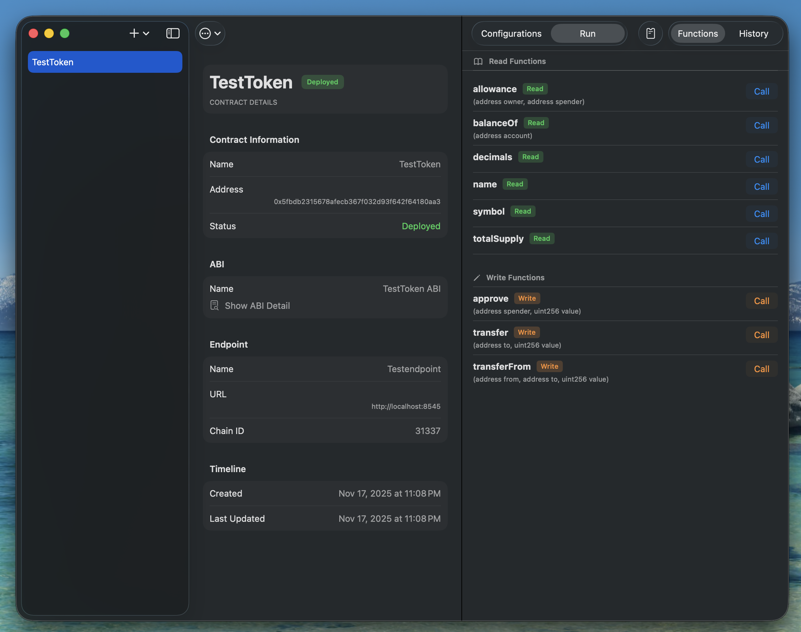

# SmartContractApp

A powerful iOS and macOS application for managing and interacting with Ethereum Smart Contracts. Built with SwiftUI and SwiftData.

## Features

- **Contract Management**: Easily import, deploy, and manage your smart contracts.
- **ABI Integration**: Import ABIs to auto-generate interaction interfaces.
- **Interactive UI**:
  - **Read Functions**: Call view/pure functions instantly.
  - **Write Functions**: Execute state-changing transactions with ease.
- **Wallet Integration**: Manage signing wallets and handle transaction signing securely.
- **Multi-Network Support**: Configure custom RPC endpoints for different chains (Localhost, Testnets, Mainnet).
- **Cross-Platform**: Seamless experience on both macOS and iOS.

## Architecture

The project is built using modern Swift technologies:

- **SwiftUI**: For a declarative and responsive user interface.
- **SwiftData**: For local persistence of contracts, ABIs, and configurations.
- **EvmCore**: A custom Swift Package that handles low-level EVM interactions:
  - ABI Parsing & Encoding
  - JSON-RPC Transport
  - Transaction Signing (BIP39, Keystore)
  - Solidity Compilation Support

## Getting Started

### Prerequisites

- Xcode 15.0+
- Swift 5.9+

### Installation

1. Clone the repository.
2. Open `SmartContractApp.xcodeproj` in Xcode.
3. Wait for Swift Package Manager to resolve dependencies (including the local `EvmCore` package).
4. Run the application on your desired simulator or device.

## Development

The core logic is contained in the `packages/EvmCore` directory. See [EvmCore Documentation](packages/EvmCore/CLAUDE.md) for more details on testing and contributing to the core library.
